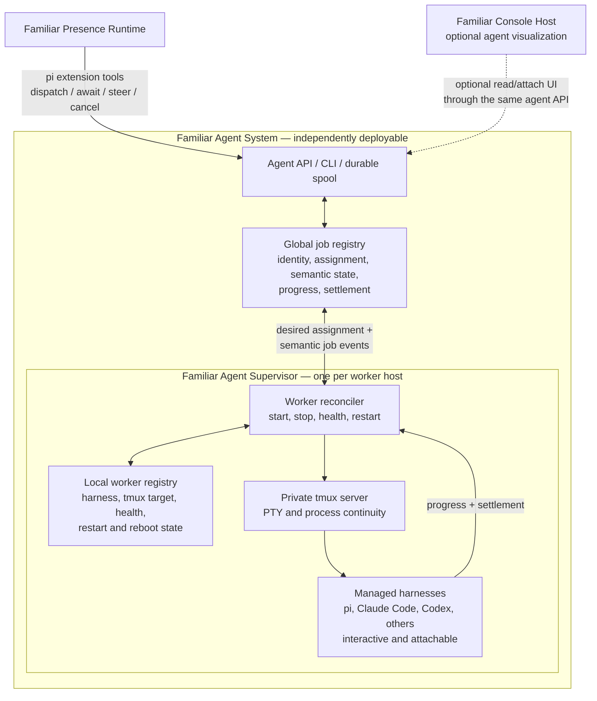

# Familiar Agents Architecture

> **Status:** proposed architecture for the optional delegated-agent system.
> This is a separate system from Familiar's presence runtime. See
> [Familiar Architecture](ARCHITECTURE.md) for Familiar itself.

The agent system runs delegated workers on one or more hosts. Familiar can use it
through ordinary pi-extension tools, but Familiar does not require it in order to
exist or maintain its primary session.

## Identity boundary

A dispatched agent is not Familiar and is not another instance of Familiar.
Agents are delegated workers executing through harnesses such as pi, Claude Code,
Codex, or future systems.

```text
Familiar / primary presence    persistent identity and continuity
Delegated agent                bounded worker performing assigned work
Harness                        executable environment used by that worker
```

This distinction remains true even when an agent is launched from Familiar and
shown prominently in a Familiar client.

## Topology



The diagram shows one supervisor. A deployment may run supervisors on personal,
work, and dedicated worker machines while retaining one semantic job namespace.

## Familiar integration

Familiar does **not** need a general plugin architecture for this integration.
The existing pi extension is sufficient:

```text
Familiar Presence Runtime
└── subagent pi extension
    ├── dispatch
    ├── subagent_await
    ├── subagent_status
    ├── subagent_respond
    └── subagent_cancel
```

The extension may call an API, invoke a CLI, or write to a durable spool. Those
are transport choices behind the tool contract.

Optional first-class visualization also does not require a generic Familiar
plugin system. A Familiar client can consume the agent system's ordinary API to
render purpose-built views such as:

- a supervision tree in a sidebar;
- running, blocked, and completed status;
- an attached terminal or transcript in the main stage;
- actions to steer, cancel, resume, or inspect a worker.

That UI is an integration between two separate systems. Its prominence does not
make delegated agents part of Familiar's core ontology or lifecycle.

## Agent service

The agent service owns global semantic job state:

- immutable job identity;
- requested harness, model, working directory, and isolation policy;
- assignment to a worker host;
- durable prompt and artifact metadata;
- progress, blocked questions, terminal settlement, and cancellation;
- idempotency, recovery, and reconciliation events.

It may be colocated with Familiar, hosted elsewhere, or provided as a fully
remote service. The contract should not assume that the Familiar Server and
agent service share a process or machine.

## Familiar Agent Supervisor

There is one Agent Supervisor per worker host. It owns host-local process reality
and can continue operating while no client is attached.

Its responsibilities are:

- reconcile assigned jobs with local workers;
- create, stop, recover, and monitor workers;
- maintain durable local worker metadata;
- create tmux sessions with the harness environment established at worker birth;
- restore eligible workers after supervisor or host restart;
- publish observed state, progress, and terminal settlement;
- preserve running workers across temporary agent-service disconnection.

The supervisor's children are managed harness processes, not Familiar clients.
They may retain full interactive TUIs. tmux makes those TUIs persistent and
attachable without granting the viewer lifecycle authority.

## Global and local registry authority

The global and local registries store different kinds of truth.

| Layer | Authoritative for | Examples |
|---|---|---|
| Global job registry | Semantic job truth | job ID, assignment, requested state, progress, settlement |
| Agent Supervisor | Host process truth | worker exists, health, restart decision, observed exit |
| Local worker registry | Durable host recovery state | harness kind, tmux target, worktree, restart policy |
| tmux server | PTY and attached process continuity | session/window/pane and terminal dimensions |
| Harness | Its own live execution/session state | current prompt, tool execution, harness-native transcript |
| Viewer | Presentation only | focus, layout, whether completion has been seen |

The local registry is not a dumb proxy. If a host reboots, the supervisor must be
able to recover eligible workers. The global registry is not a process table.
They reconcile across a narrow boundary:

```text
agent service → desired job assignment and cancellation
supervisor    → observed worker state, progress, and settlement
```

Offline recreation policy must be explicit so a disconnected supervisor does
not resurrect work whose assignment was revoked elsewhere.

## tmux and observability

A private pinned tmux server owns persistent PTYs. Each worker receives a stable
tmux target and attach endpoint.

```text
Agent Supervisor
├── create tmux session/window/pane
├── inject harness environment
├── start harness process
└── register stable worker + attach endpoint

Viewer
└── attach to existing tmux target
```

Killing a viewer kills only its attach client. The worker remains under the tmux
server and Agent Supervisor.

Status cannot rely on the viewer's foreground-process tree: a `tmux attach`
client is not the parent of the worker; the tmux server is. Status authority
should therefore be:

1. explicit harness lifecycle events;
2. Agent Supervisor process and PTY observation;
3. terminal-screen inference only as degraded fallback.

## Harness adapters

A harness adapter translates the common job lifecycle into harness-specific
launch, resume, steering, and observation behavior.

```text
Common lifecycle
├── start
├── prompt / steer
├── observe
├── answer blocked question
├── cancel
├── resume
└── collect settlement

Adapters
├── pi
├── Claude Code
├── Codex
└── future harnesses
```

Harness-specific transcripts remain harness data unless projected into the
common progress/settlement model. The agent system should not pretend every
harness has identical semantics.

## Failure and recovery

- Agent-service failure does not immediately kill running workers.
- Viewer failure never kills workers.
- tmux-server failure is a worker-process failure boundary and must be explicit.
- Agent Supervisor restart reconstructs state from its local registry and tmux.
- Host reboot restores workers according to persisted restart policy.
- Duplicate progress and settlement delivery is handled idempotently.
- Global assignment and local observed state reconcile after partitions.
- A worker cannot become globally terminal until settlement ownership is durably
  committed or an explicit failure state is recorded.

## Open decisions

1. **Agent service kernel:** small SQLite-backed service, filesystem spool plus
   daemon, or another durable implementation.
2. **Transport:** local CLI/socket, authenticated network API, or both.
3. **Assignment:** explicit host selection versus capability-based scheduling.
4. **Offline policy:** which workers may restart while disconnected and for how
   long.
5. **Status schema:** common lifecycle vocabulary and harness-specific detail.
6. **Terminal access:** direct authenticated tmux attachment versus a terminal
   proxy suitable for browser/mobile clients.
7. **UI integration:** exact Familiar client views consuming the agent API.
8. **Artifacts and worktrees:** ownership, retention, garbage collection, and
   portability across hosts.

## Architectural rule

> The agent service owns jobs. Agent Supervisors own workers. tmux owns PTYs.
> Harnesses own execution. Familiar calls the system through tools.

The agent system may be absent, remote, or replaced without changing Familiar's
identity or primary-session architecture.
