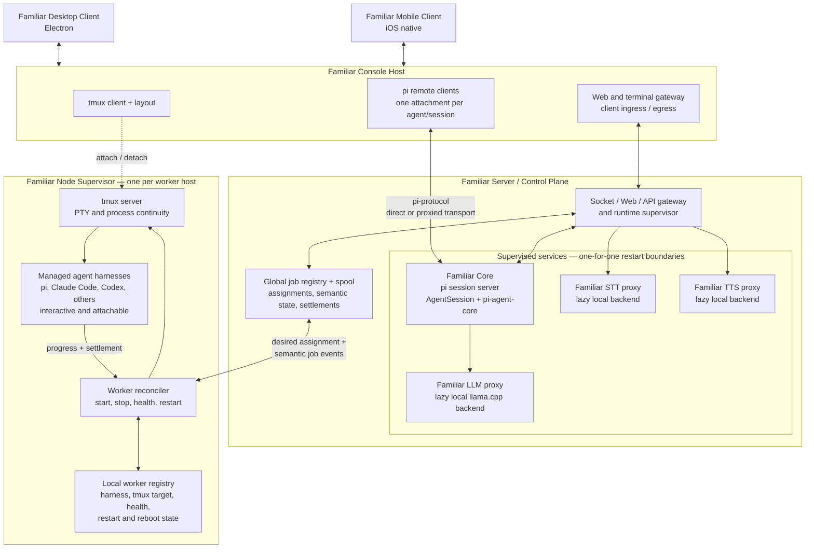

# Familiar Architecture

> **Status:** proposed target architecture. This document captures the current
> design direction and names the boundaries that are already load-bearing. Open
> decisions are listed explicitly rather than hidden inside the diagram.

Familiar is moving from a terminal application that owns its agents toward a
runtime whose agents survive every individual interface. The runtime owns
continuity, work, and process supervision; desktop, mobile, terminal, and web
surfaces are disposable clients.

## Topology



The diagram shows one node supervisor, but a deployment may have one on a
personal machine, one on a work machine, and more on dedicated worker hosts.

## Components

### Familiar clients

The Electron desktop client and native mobile client present Familiar. They do
not own sessions, workers, or transcripts. Closing a client must not stop an
agent.

### Familiar Console Host

The Console Host is the local presentation bridge. It may be embedded into the
desktop application or run as a companion service.

It hosts:

- **tmux clients and layout**, not the authoritative tmux server;
- **pi remote clients** attached to one or more pi sessions;
- **web and terminal ingress/egress** for interfaces that cannot connect to a
  Unix socket or PTY directly.

The Console Host is deliberately disposable. It can disappear and reconnect
without becoming a process or session authority.

### Familiar Server / Control Plane

The control plane owns global semantic truth:

- jobs and immutable job identity;
- assignment to a worker host;
- durable spool state, events, and settlements;
- the primary Familiar session runtime;
- client-facing routing and authentication;
- supervision of LLM, STT, and TTS service proxies.

It does **not** own the operating-system reality of every remote worker process.
That belongs to the node on which the process runs.

### Familiar Core and pi's client/server split

Familiar should use pi's existing client/server layering rather than fork pi.
The runtime side is more than the raw `pi-agent-core` package:

```text
pi session server
├── pi-coding-agent AgentSession/runtime
├── pi-agent-core
├── tools and extensions
├── transcript and session persistence
└── pi-protocol server
```

The client side is:

```text
pi remote TUI/client
├── pi-coding-agent client UI
├── pi-client / RemoteSession
└── pi-tui
```

`pi-protocol` is the boundary between them: length-framed CBOR over an ordered
transport, initially a Unix-domain socket and optionally proxied for remote
clients. The pi TUI is therefore a reconnectable viewer, not the owner of the
agent session.

### Familiar Node Supervisor

There is one node supervisor per worker host. It owns local process reality and
continues operating when no UI is attached.

Its responsibilities are:

- reconcile assigned work with local workers;
- create and recover workers after supervisor or host restart;
- maintain the local worker registry;
- create tmux sessions/panes with the correct harness environment;
- monitor health and publish progress or terminal settlement;
- preserve existing workers across temporary control-plane disconnection.

The children are **managed agent harnesses**, not Familiar clients. A child may
be pi, Claude Code, Codex, or another harness. It may retain its full interactive
TUI; observability is the reason its PTY lives in tmux.

### tmux

The node's private tmux server is the authority for PTY and process continuity.
A console-side tmux client is only a disposable attachment.

```text
node tmux server            authoritative PTY + worker process
console tmux client         layout, input, and observation
```

Killing or replacing the Console Host must kill only its attach client, never
the worker.

## Authority model

Each layer owns a different kind of truth. This is intentional rather than a
partially replicated registry.

| Layer | Authoritative for | Not authoritative for |
|---|---|---|
| Familiar control plane | Job identity, assignment, semantic state, settlements | PIDs and immediate host process reality |
| Node supervisor | Workers present on that host, restart policy, health, tmux targets | Global job history or assignments to other hosts |
| tmux server | PTY and attached process continuity | Job meaning or terminal status |
| pi session server | Agent/session state and transcript | Host-wide scheduling |
| Console Host and clients | Presentation, input, layout | Worker or session lifetime |

The node registry is not a dumb cache. It must be durable enough to recover
workers after a reboot. The global registry is not a process table. The two
reconcile across a narrow desired-state/event boundary:

```text
control plane → desired assignment
node          → observed worker state, progress, settlement
```

## Supervision and failure boundaries

The control plane is a supervision tree, but containment does not imply that all
children restart together. The default strategy is equivalent to Erlang
`one_for_one`:

- a local llama.cpp backend may restart without killing Familiar Core;
- Familiar Core may remain alive while inference is temporarily unavailable;
- STT or TTS failure degrades voice without ending text sessions;
- a Console Host or client may restart without touching sessions or workers;
- a node supervisor keeps existing workers alive during a control-plane outage;
- after node reboot, its durable local registry drives recovery, followed by
  reconciliation with global desired state.

The Familiar LLM/STT/TTS services are stable proxies. Lazy local backends are
replaceable children behind those endpoints. A dependency or readiness edge is
not automatically a shared crash boundary.

## Agent status

Status must come from explicit worker lifecycle events and the node registry,
not from guessing which foreground process a viewer happens to see. This is
necessary because an attached tmux client is not the parent of the agent process;
the tmux server is.

The preferred order of authority is:

1. harness lifecycle hook or explicit worker event;
2. node supervisor process/PTY observation;
3. terminal-screen inference as a degraded fallback.

Viewer focus may determine whether an idle completion is displayed as “done,”
but it must not determine worker lifecycle truth.

## Open decisions

1. **Console deployment:** embedded in Electron, companion daemon, or both.
2. **Remote transport:** where Unix-socket pi protocol becomes authenticated
   WebSocket or another network-safe transport for mobile and remote clients.
3. **Primary-session placement:** always central, or represented as another
   node-managed worker with stronger continuity policy.
4. **Offline reconciliation:** how long a node may recreate assigned workers
   while disconnected, and how revoked assignments resolve after reconnection.
5. **Terminal projection:** direct tmux attachment versus a Familiar terminal
   protocol for browser/mobile clients.
6. **Status protocol:** exact lifecycle event schema shared by pi and other
   harnesses.

## Architectural rule

> Control plane owns work. Node supervisors own workers. tmux owns PTYs. pi
> session servers own transcripts. Clients own presentation.

No viewer is required for the system to remain alive.
