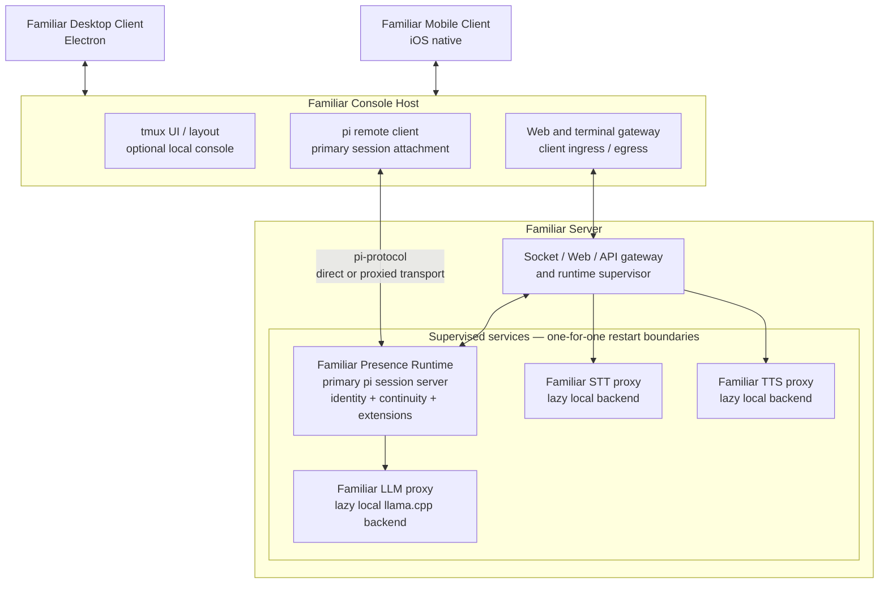

# Familiar Architecture

> **Status:** proposed target architecture. This document describes Familiar
> itself. The separately deployable agent-dispatch system is deliberately
> excluded; see [Familiar Agents Architecture](AGENTS-ARCHITECTURE.md).

Familiar is a persistent presence with disposable interfaces. The runtime owns
identity, continuity, sessions, and service supervision. Desktop, mobile,
terminal, and web surfaces may come and go without ending the primary session.

## Topology



## Identity boundary

Familiar is not a dispatched agent. The primary presence has identity,
continuity, relationship history, and a long-lived session. Pi's internal
“agent” terminology describes an implementation layer; it does not define the
entity Familiar presents.

Dispatched workers are separate delegated processes. Familiar may call an agent
system through tools, but that system is no more constitutive of Familiar than a
calendar, task service, or search provider. Its architecture lives in
[AGENTS-ARCHITECTURE.md](AGENTS-ARCHITECTURE.md).

## Components

### Familiar clients

The Electron desktop client and native mobile client present Familiar. They do
not own the primary session or transcript. Closing a client must not stop the
presence runtime.

### Familiar Console Host

The Console Host is the local presentation bridge. It may be embedded in the
desktop application or run as a companion service.

It may host:

- an optional tmux-based local console and layout;
- a pi remote client attached to the primary session;
- web and terminal ingress/egress for interfaces that cannot connect to a Unix
  socket or terminal directly.

The Console Host is disposable. It can disappear and reconnect without becoming
the session authority.

### Familiar Server

The Familiar Server supervises the persistent runtime and exposes it to clients.
It owns:

- the primary Familiar presence runtime;
- client-facing socket, web, and API routing;
- configuration, readiness, and process lifecycle;
- stable LLM, STT, and TTS service endpoints.

The server supervisor should coordinate processes and signals, not reimplement
pi's transcript or model semantics.

### Familiar Presence Runtime

The Presence Runtime is the long-lived primary session and continuity boundary.
It uses pi's session machinery internally while preserving a distinction between
Familiar's identity and pi's implementation vocabulary.

The runtime side is more than the raw `pi-agent-core` package:

```text
Familiar Presence Runtime
└── pi session server
    ├── pi-coding-agent AgentSession/runtime
    ├── pi-agent-core
    ├── Familiar tools and extensions
    ├── transcript and session persistence
    └── pi-protocol server
```

The client side is:

```text
pi remote client
├── pi-coding-agent client UI
├── pi-client / RemoteSession
└── pi-tui
```

`pi-protocol` is the boundary between them: length-framed CBOR over an ordered
transport, initially a Unix-domain socket and optionally proxied for remote
clients. The pi TUI is a reconnectable viewer, not the owner of the primary
session.

Familiar should use this existing pi layering rather than fork pi.

### Model and voice services

Familiar LLM, STT, and TTS are stable service proxies supervised beside the
Presence Runtime. Local backends may be started lazily and replaced without
changing the endpoint consumed by Familiar.

```text
Familiar LLM proxy
└── lazy local llama.cpp backend, when needed

Familiar STT proxy
└── lazy local transcription backend, when needed

Familiar TTS proxy
└── lazy local synthesis backend, when needed
```

Remote providers and local backends are routing choices behind these service
boundaries, not separate client architectures.

## Authority model

| Layer | Authoritative for | Not authoritative for |
|---|---|---|
| Familiar Presence Runtime | Primary session, transcript, identity and continuity state | Client lifetime or rendering |
| Familiar Server | Process supervision, configuration, readiness, service routing | Pi transcript/model semantics |
| LLM/STT/TTS proxies | Stable service endpoints and backend lifecycle | Primary-session ownership |
| Console Host | Local presentation bridge and attachment | Session lifetime |
| Desktop/mobile clients | Presentation and input | Runtime or transcript authority |

## Supervision and failure boundaries

The Familiar Server is a supervision tree, but containment does not imply that
all children restart together. The default strategy is equivalent to Erlang
`one_for_one`:

- a local llama.cpp backend may restart without killing the Presence Runtime;
- the Presence Runtime may remain alive while inference is temporarily
  unavailable;
- STT or TTS failure degrades voice without ending text sessions;
- a Console Host or client may restart without touching the primary session;
- a broken presentation surface cannot become a runtime failure.

A dependency or readiness edge is not automatically a shared crash boundary.

## Open decisions

1. **Console deployment:** embedded in Electron, companion daemon, or both.
2. **Remote transport:** where Unix-socket pi protocol becomes authenticated
   WebSocket or another network-safe transport for mobile and remote clients.
3. **Terminal projection:** direct terminal attachment versus a Familiar terminal
   protocol for browser/mobile clients.
4. **Persistence boundary:** which continuity metadata belongs directly beside
   pi's session store versus in a small Familiar-owned store.
5. **Service placement:** whether LLM/STT/TTS proxies always run with the Familiar
   Server or may be discovered remotely.

## Architectural rule

> The Presence Runtime owns continuity. The Familiar Server owns supervision.
> Service proxies own backend lifecycle. Clients own presentation.

No viewer is required for Familiar to remain alive.
