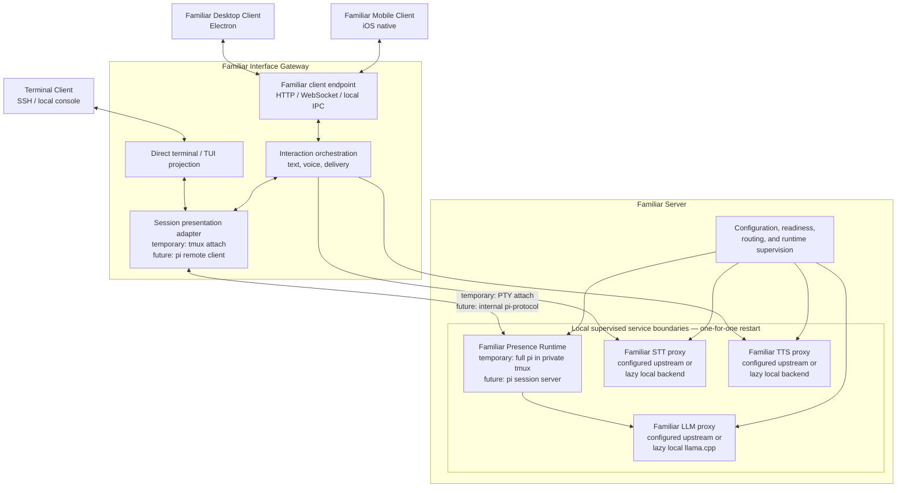

# Familiar Architecture

> **Status:** proposed target architecture. This document describes Familiar
> itself. The separately deployable agent-dispatch system is deliberately
> excluded; see [Familiar Agents Architecture](AGENTS-ARCHITECTURE.md).

Familiar is a persistent presence with disposable interfaces. The runtime owns
identity, continuity, sessions, and service supervision. Desktop, mobile,
terminal, and web surfaces may come and go without ending the primary session.

## Topology



The Interface Gateway and Familiar Server are logical components. A deployment
may colocate them, but clients never connect directly to the Presence Runtime's
pi-protocol endpoint.

## Identity boundary

Familiar is not a dispatched agent. The primary presence has identity,
continuity, relationship history, and a long-lived session. Pi's internal
“agent” terminology describes an implementation layer; it does not define the
entity Familiar presents.

Dispatched workers are separate delegated processes. Familiar may call an agent
system through tools, but that system is no more constitutive of Familiar than a
calendar, task service, or search provider. Its architecture lives in
[AGENTS-ARCHITECTURE.md](AGENTS-ARCHITECTURE.md).

## Components

### Familiar clients

The Electron desktop client, native mobile client, and terminal surfaces present
Familiar. They do not own the primary session or transcript. Closing a client
must not stop the Presence Runtime.

The desktop bundle supports two deployment paths:

- **Remote:** connect to an existing Familiar URL.
- **Local:** download and start the pinned local runtime components lazily.

Logical separation remains intact when all components run on one machine. The
Electron application is a bootstrap and presentation client, not the runtime
itself.

### Familiar Interface Gateway

The Interface Gateway is intentionally a hybrid layer: it is a server to
Familiar clients and a client of the internal pi session runtime. “Gateway” names
that role rather than forcing it into either side.

It owns:

- the Familiar-facing HTTP, WebSocket, or local-IPC endpoint;
- the session-presentation adapter used for application traffic;
- text and voice interaction orchestration;
- response delivery and presentation selection;
- direct terminal/TUI projection for the current interface.

A voice interaction may cross several services:

```text
voice input
→ Familiar Interface Gateway
→ Familiar STT
→ Familiar Presence Runtime
→ Familiar LLM
→ Familiar Interface Gateway
→ Familiar TTS, when voice output is requested
→ client delivery
```

For now, terminal interfaces attach directly rather than introducing a new
terminal protocol. A future HTML/canvas/chat presentation may project the same
session without replacing the direct terminal path.

### Familiar Server

The Familiar Server supervises the persistent runtime and its local capability
proxies. It owns:

- the primary Familiar Presence Runtime;
- configuration, readiness, and process lifecycle;
- stable local LLM, STT, and TTS proxy endpoints;
- local routing between supervised components.

The server supervisor coordinates processes and signals. It does not reimplement
pi's transcript or model semantics.

### Familiar Presence Runtime

The Presence Runtime is the long-lived primary session and continuity boundary.
It uses pi's session machinery internally while preserving a distinction between
Familiar's identity and pi's implementation vocabulary.

The runtime side is more than the raw `pi-agent-core` package:

```text
Familiar Presence Runtime
└── pi session server
    ├── pi-coding-agent AgentSession/runtime
    ├── pi-agent-core
    ├── Familiar tools and extensions
    ├── transcript and session persistence
    └── pi-protocol server
```

The internal client side is:

```text
pi remote client
├── pi-coding-agent client facilities
├── pi-client / RemoteSession
└── pi-tui for direct terminal presentation
```

`pi-protocol` is length-framed CBOR over an ordered transport. In the target
state it remains an internal boundary between the Interface Gateway and Presence
Runtime; it is not the public desktop/mobile protocol. Familiar should use pi's
existing layering as it matures rather than fork pi.

### Temporary pi adapter

Pi 0.84.1 has stable interactive and headless RPC modes, but its experimental
persistent server and detachable standard TUI are not yet a complete supported
workflow. Familiar therefore closes over the current implementation behind two
replaceable adapters:

```text
Presence Runtime adapter
  now:    full interactive pi instance in a private tmux session
  future: persistent pi session server

Session presentation adapter
  now:    direct tmux attachment / existing terminal projection
  future: detachable pi remote client and TUI
```

The private tmux server keeps the complete pi process alive when no presentation
is attached. Closing a terminal or Interface Gateway attachment kills only the
attach client. Existing web/extension ingress continues to handle non-terminal
interactions during this phase.

The adapter contract, not tmux, is architectural. tmux session names, pane IDs,
and terminal-detection behavior must not leak into clients or the wider server.
When pi's native split becomes usable, both adapter internals can be replaced
without changing the Familiar client protocol, service boundaries, or presence
identity.

A stable RPC relay remains an available intermediate implementation if semantic
session access becomes necessary before pi's detachable TUI is ready; it is not
required for the initial tmux-backed migration.

### Model and voice services

Familiar LLM, STT, and TTS are always-local proxy components of the Familiar
Server. “Local” describes the proxy boundary, not necessarily the backend doing
the work.

Each proxy follows the same routing rule:

```text
configured endpoint present → forward through the local proxy
no endpoint configured      → lazily start and supervise the local backend
```

The proxy remains the stable endpoint consumed by Familiar. Remote services and
local implementations can change without changing the surrounding architecture.

## Durable ownership

The ownership boundary is architectural; the storage engine is an implementation
decision.

```text
pi-owned session state
├── transcript and session events
├── model and thinking state
└── tool calls and results

Familiar-owned continuity state
├── identity and canon
├── handoffs and continuity metadata
├── Familiar configuration
└── client/device preferences
```

Familiar-owned state may remain files or move into a small database later. That
does not change the rule: pi owns its session record; Familiar owns continuity
beyond that session.

## Authority model

| Layer | Authoritative for | Not authoritative for |
|---|---|---|
| Familiar Presence Runtime | Primary session, transcript, identity and continuity state | Client lifetime or rendering |
| Familiar Server | Process supervision, configuration, readiness, local service routing | Pi transcript/model semantics |
| Interface Gateway | Interaction orchestration, public client protocol, delivery | Primary-session lifetime |
| LLM/STT/TTS proxies | Stable local service endpoints and backend lifecycle | Primary-session ownership |
| Desktop/mobile/terminal clients | Presentation and input | Runtime or transcript authority |

## Supervision and failure boundaries

The Familiar Server is a supervision tree, but containment does not imply that
all children restart together. The default strategy is equivalent to Erlang
`one_for_one`:

- a local llama.cpp backend may restart without killing the Presence Runtime;
- the Presence Runtime may remain alive while inference is temporarily
  unavailable;
- STT or TTS failure degrades voice without ending text sessions;
- the Interface Gateway may restart without ending the primary session;
- a client may restart without touching either server component;
- a broken presentation surface cannot become a runtime failure.

A dependency or readiness edge is not automatically a shared crash boundary.

## Proposed monorepo boundaries

Organize code by deployable role rather than implementation language:

```text
apps/
  desktop/                 # Electron client
  mobile/                  # native iOS client

services/
  gateway/                 # Familiar Interface Gateway
  server/                  # supervisor, bootstrap, readiness
  presence/                # primary pi session + continuity
  llm/                     # stable LLM proxy + lazy backend
  stt/                     # stable STT proxy + lazy backend
  tts/                     # stable TTS proxy + lazy backend

packages/
  client-protocol/         # client ↔ Interface Gateway schema
  config/                  # shared configuration model
  continuity/              # Familiar-owned canon/handoff persistence
  ui/                      # shared web/UI assets, when useful

integrations/
  pi/                      # pi-specific adapters and extensions
```

The architecture names map directly to directories:

| Architecture component | Directory |
|---|---|
| Familiar Desktop Client | `apps/desktop` |
| Familiar Mobile Client | `apps/mobile` |
| Familiar Interface Gateway | `services/gateway` |
| Familiar Server | `services/server` |
| Familiar Presence Runtime | `services/presence` |
| Familiar LLM | `services/llm` |
| Familiar STT | `services/stt` |
| Familiar TTS | `services/tts` |

Use `presence`, not `core`: “core” becomes ambiguous as the system grows, while
“presence” preserves the identity and lifecycle boundary this component owns.

This is a boundary and naming plan, not a requirement to create empty
scaffolding. Create each directory when it receives owned code, tests, a build
artifact, or an independently enforced dependency boundary.

## Settled deployment decisions

1. **Client/runtime separation:** Electron remains separate from the runtime. It
   can connect remotely or lazily install and launch a pinned local deployment.
2. **External protocol:** clients speak a Familiar-owned application protocol to
   the Interface Gateway. The Presence Runtime's pi-protocol is never exposed
   directly.
3. **Terminal projection:** direct attachment remains the initial implementation.
   Rich HTML/canvas/chat projection is additive future work.
4. **Durable ownership:** pi owns session records; Familiar owns identity and
   continuity beyond the pi session. Storage format is deferred.
5. **Service placement:** LLM/STT/TTS proxies are local Familiar Server
   components. Configured remote endpoints sit behind those proxies; absent
   endpoints trigger lazy local backends.

## Remaining design work

1. Define the Familiar client protocol's message schema, authentication,
   reconnect, replay, and delivery semantics.
2. Define secure component download, version pinning, verification, upgrade, and
   rollback for local mode.
3. Decide the first non-terminal presentation model without coupling it to pi's
   terminal rendering.

## Architectural rule

> The Presence Runtime owns continuity. The Familiar Server owns supervision and
> local capabilities. The Interface Gateway owns interaction and delivery.
> Clients own presentation.

No viewer is required for Familiar to remain alive.
